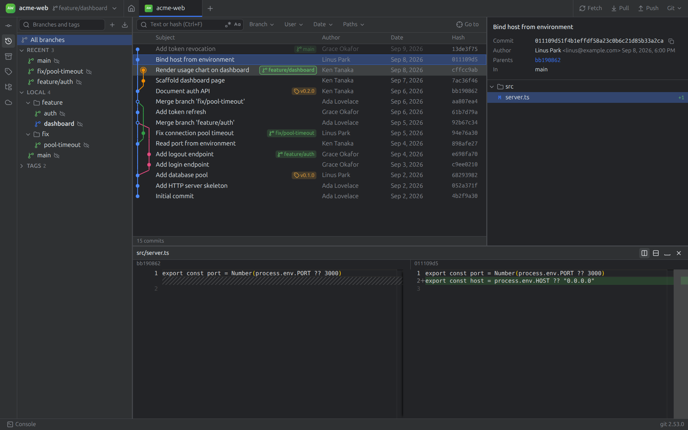
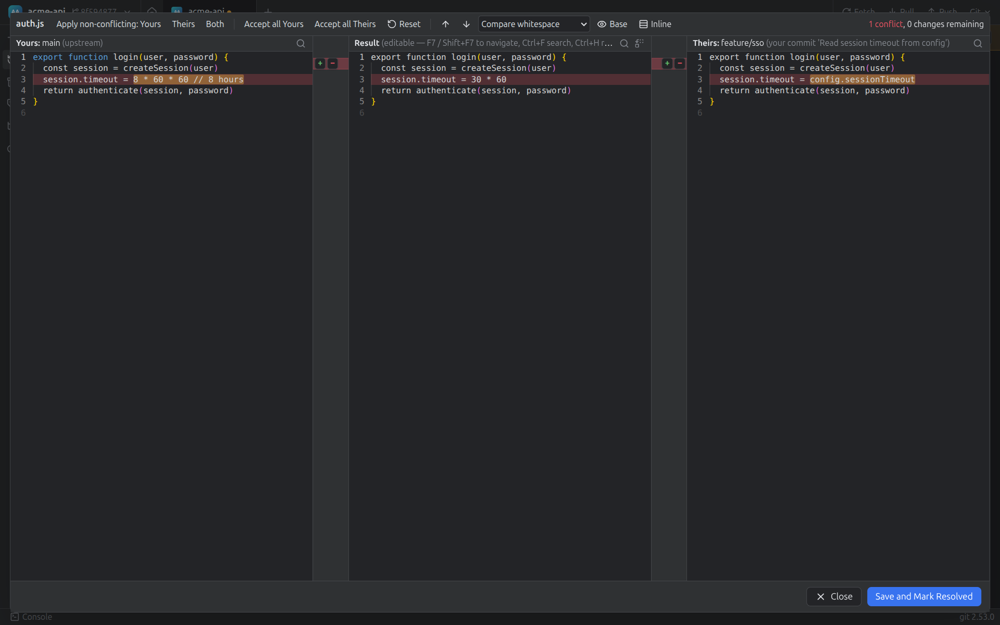
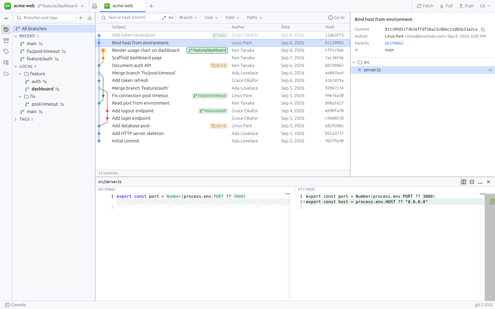

# GitClient — free, open-source Git GUI for Linux and Windows

[](https://github.com/phil288/git-client/actions/workflows/ci.yml)
[](https://github.com/phil288/git-client/releases/latest)
[](LICENSE)


**GitClient** is a standalone desktop Git client that brings IDE-style Git tooling to any
project, without an IDE: the Log tab with a commit
graph, the Branches popup, the Commit tool window, the interactive rebase dialog and the 3-way merge
tool. It runs on Linux (Ubuntu/Debian package, AppImage, tarball) and Windows 10/11, is built with Electron, React and TypeScript, and
calls your installed `git` directly — no account, no telemetry, no cloud (the only network call
of its own is the release update check, which can be turned off).



## Features

- **Commit graph / log** — fast virtualized history with lane graph, branch and tag labels,
  commit details and Monaco side-by-side diffs; tested on 100,000-commit repositories.
- **Search and filters** — text, regex, hash, author, branch, date range and path filters; Go to
  hash or ref.
- **Branches** — local/remote tree, favorites, smart checkout, create, rename, delete several at once,
  merge, rebase, compare, fetch/pull/push, upstream tracking.
- **Interactive rebase** — reword, squash, fixup, drop and reorder commits in a dialog, with backup
  refs and one-click undo; reset, revert, cherry-pick, patches and reflog.
- **Commit tool window** — stage files or individual hunks, discard, amend, sign-off,
  commit and push.
- **3-way merge tool** — conflicts dialog with correct Yours/Theirs labels for merge, rebase and
  cherry-pick, auto-resolve, per-chunk accept/remove, editable result, merge preview, rerere.
- **Stash, file history, blame, tags, remotes and worktrees** — including creating, locking,
  pruning and merging Git worktrees.
- **Desktop integration** — tabs for several repositories, quick switcher (`Ctrl+E`), "Open in
  GitClient" in Explorer/Nautilus, `gitclient .` from the terminal, auto-fetch, update check (one-click update on Windows).
- **Transparent** — the Git Console (`Alt+9`) shows every git command it runs, with duration and
  output.



<details>
<summary>Light theme</summary>



</details>

## Who is it for?

- Developers who like IDE-integrated Git tools but work in VS Code, Neovim, Zed or the terminal.
- Linux users looking for a native-feeling Git GUI (GitKraken, Fork, Tower and Sourcetree are
  either paid, closed source or not available on Linux).
- Anyone who wants a free, open-source, offline Git client that does not wrap Git in its own
  abstractions: every action maps to a real `git` command you can see.

## Install

### Linux

```bash
curl -fsSL https://raw.githubusercontent.com/phil288/git-client/main/install.sh | bash
```

On Debian/Ubuntu this downloads the `.deb`, verifies its SHA-256 against the release's `SHA256SUMS`,
and installs it with `apt` (it asks for `sudo` and says why). apt pulls in dependencies (including
`git`), the menu entry, the `gitclient` command and the Chromium sandbox/AppArmor setup.

Options (pass after `bash -s --`):

| Option | Env var | Effect |
| --- | --- | --- |
| `--user` | | No sudo: installs into `~/.local/share/gitclient`, `~/.local/bin/gitclient` and a menu entry. Default on non-Debian distros. |
| `--version v1.2.0` | `GITCLIENT_VERSION` | Install that release instead of the latest |
| `--uninstall` | | Remove GitClient (settings in `~/.config/GitClient` are kept) |
| `--uninstall --purge` | | Also delete settings |
| `--quiet` | `GITCLIENT_QUIET=1` | Only errors and the result |
| | `GITHUB_TOKEN` | Optional: raises the GitHub API rate limit (or for a private fork) |

```bash
curl -fsSL https://raw.githubusercontent.com/phil288/git-client/main/install.sh | bash -s -- --user --version v0.1.0
```

**From a clone of this repository** the installer uses your local build instead of downloading:

```bash
./install.sh            # .deb from dist/ via apt
./install.sh --user     # tar.gz from dist/ into ~/.local
```

If `dist/gitclient-linux-x64.{deb,tar.gz}` is missing or older than the sources (`src/`, `build/`,
`package.json`, lock file, builder/vite config), it builds just that package first
(`npm ci` if `node_modules` is missing, `npm run build`, `electron-builder`), as your user, never as
root. `--rebuild` forces a build; `--remote` (or `--version`) downloads a release instead. Local
builds have no release `SHA256SUMS`, so that check is skipped and the version is recorded as
`v<version>-local`.

Running the installer again upgrades. On Ubuntu 23.10+/24.04 a `--user` install cannot ship the
AppArmor profile the Chromium sandbox needs; the installer detects this and prints the exact
one-line fix (it never launches with `--no-sandbox`).

### Windows 10/11 (PowerShell 5.1 or 7)

```powershell
irm https://raw.githubusercontent.com/phil288/git-client/main/install.ps1 | iex
```

Downloads `gitclient-windows-x64-setup.exe`, verifies its SHA-256, and runs the per-user installer
silently (`%LOCALAPPDATA%\Programs`, no admin rights). It adds Start-menu and desktop shortcuts, puts
`gitclient` on your user PATH and registers "Open in GitClient" on folders (toggle in Settings).
If Git for Windows is missing it tells you to run `winget install --id Git.Git -e`.

`irm | iex` cannot pass parameters, so options are environment variables (or parameters when you
save and run the script):

| Parameter | Env var | Effect |
| --- | --- | --- |
| `-Version v1.2.0` | `GITCLIENT_VERSION` | Install that release |
| `-Uninstall` | `GITCLIENT_UNINSTALL=1` | Run the uninstaller silently (settings in `%APPDATA%\GitClient` are kept) |
| `-Quiet` | `GITCLIENT_QUIET=1` | Only errors and the result |
| | `GITHUB_TOKEN` | Optional: raises the GitHub API rate limit (or for a private fork) |

```powershell
$env:GITCLIENT_VERSION = 'v0.1.0'; irm https://raw.githubusercontent.com/phil288/git-client/main/install.ps1 | iex
```

### Updates

GitClient checks the latest GitHub release at startup (Settings → General) and from
Help → Check for Updates. On Windows it downloads and restarts into the new version (one click,
electron-updater). On Linux it shows the version and a "Copy update command" button with the right
one-liner (`--user` if that is how it was installed), plus a link to the release page.

### Manual download

Every release on the [Releases page](https://github.com/phil288/git-client/releases) has stable asset names:
`gitclient-linux-x64.deb`, `gitclient-linux-x64.tar.gz`, `gitclient-linux-x64.AppImage`,
`gitclient-windows-x64-setup.exe`, plus `SHA256SUMS`. The latest is always at
`https://github.com/phil288/git-client/releases/latest/download/<asset>`.

### Maintainers

Publishing a release and testing the install one-liners: [docs/RELEASING.md](docs/RELEASING.md).

## Status

| Milestone | Scope | State |
| --- | --- | --- |
| 1 | Scaffold, secure IPC, GitService + git detection + console, packaging config, welcome screen, recents/pins/groups, open/init/clone/scan, tabs, repo switcher, quick switcher, session restore, single instance + CLI | done |
| 2 | Log: paged streaming, lane graph, virtualized table, ref labels, details, Monaco diff | done |
| 3 | Search & filters: text/regex/hash/author, branch, user, date, paths, Go to | done |
| 4 | Branches: tree, favorites/recent, smart checkout, create/rename/delete (also several at once)/restore, merge, rebase, compare, fetch/pull/push, upstream | done |
| 5 | History rewriting: scripted `rebase -i`, backup refs + undo, reword/squash/fixup/drop/reorder, reset, revert, cherry-pick, patches, reflog, rebase-in-progress mode | done |
| 6 | Local changes & commit: file/hunk staging, discard, amend, sign-off, commit and push | done |
| 7 | Stash, file history, blame, tags, remotes | done |
| 8 | Conflicts: banner, conflicts dialog with correct Yours/Theirs, auto-resolve, 3-way merge editor, special types, merge-tree preview, rerere | done |
| 9 | Settings, auto-fetch, jump list, Explorer/Nautilus entries, error handling, 100k-commit performance | done |
| 10 | CI + release workflows, stable assets + SHA256SUMS, install.sh, install.ps1, update check | done |
| — | Worktrees: list, create (new/existing branch), open in tab, lock/unlock, prune, remove (`-f -f` force), merge into main with worktree + branch cleanup | done |

## FAQ

**Is GitClient free?**
Yes. It is open source under the MIT license, with no paid tier, account or license key.

**Can I use IDE-style Git tools without an IDE?**
That is what GitClient is for: it provides Log, Branches, Commit, interactive rebase
and merge-conflict tools as a standalone app that works with any editor.

**Which platforms are supported?**
Linux x64 (`.deb` for Ubuntu 22.04/24.04 and Debian, AppImage and `.tar.gz` for other distros) and
Windows 10/11 x64. A Linux arm64 build is attempted for each release. macOS is not packaged yet.

**Does it replace the git command line?**
No, it drives it. GitClient runs your installed `git` (2.30+) with argument arrays and shows every
command in the Git Console, so anything it does can be reproduced or undone from a terminal.

**How does it compare to GitKraken, Fork, Sourcetree, GitHub Desktop or Sublime Merge?**
It is free and open source (unlike GitKraken, Fork, Tower and Sublime Merge), runs on Linux (unlike
Fork, Tower and Sourcetree), and covers advanced workflows that GitHub Desktop leaves out:
interactive rebase, a 3-way merge editor, reflog, worktrees, blame and file history.

**Does it work with GitHub, GitLab, Bitbucket and self-hosted Git servers?**
Yes. It uses your existing git remotes, credential helpers and SSH keys; it has no
hosting-provider integration of its own.

**Is it fast on large repositories?**
The log streams history in pages into a virtualized table; `npm run test:perf` times the pipeline on
a generated 100,000-commit repository.

**Is it safe?**
The renderer is sandboxed with context isolation and a strict CSP, git is spawned without a shell,
and interactive rebase creates backup refs so it can be undone. See [SECURITY.md](SECURITY.md)
to report a vulnerability.

## Requirements

- **Node.js 22.12+** and npm 10+ (for development only; the packaged app bundles its own runtime)
- **git 2.30+** on `PATH` (or in a standard install location; configurable)
  - Ubuntu: `sudo apt install git`
  - Windows: `winget install --id Git.Git -e`

## Development

### Ubuntu (22.04 / 24.04)

```bash
sudo apt install git
npm install          # also downloads the Electron binary
npm run dev          # starts Electron with hot reload
```

To run the AppImage you build yourself, Ubuntu 22.04+ needs FUSE 2: `sudo apt install libfuse2` (22.04) or `libfuse2t64` (24.04).

### Windows 10/11

```powershell
winget install --id Git.Git -e
winget install --id OpenJS.NodeJS.LTS -e
npm install
npm run dev
```

### Commands

| Command | What it does |
| --- | --- |
| `npm run dev` | Electron + Vite dev server with HMR for the renderer |
| `npm run build` | Production build into `out/` |
| `npm run preview` | Run the production build |
| `npm run typecheck` | `tsc` for main/preload/tests and for the renderer (strict) |
| `npm run lint` | ESLint (includes a rule that forbids `exec()` and `shell: true`) |
| `npm test` | Vitest: parsers and pure logic, plus integration tests on throwaway repos in a temp dir |
| `npm run test:e2e` | Builds, then runs Playwright tests against the real Electron app |
| `npm run test:perf` | Builds a 100,000-commit repository and times the log pipeline |
| `npm run dist:linux` | AppImage + `.deb` + `.tar.gz` in `dist/` (run on Linux) |
| `npm run dist:win` | NSIS installer in `dist/` (run on Windows) |
| `npm run icons` | Regenerates `build/icon.png` |
| `node scripts/screenshots.mjs` | Regenerates `docs/images/*.png` from the built app with demo repos (run `npm run build` first) |
| `scripts/og-image.sh` | Renders the social preview `site/og.png` from `site/og.html` (needs Chrome/Chromium) |

E2E tests on a CI runner, or where the Chromium sandbox cannot start from `node_modules`, need
`E2E_NO_SANDBOX=1` (only the tests pass `--no-sandbox`; the app itself never does).

### Opening repositories from the command line

```bash
gitclient .                 # the packaged app (the .deb installs /usr/bin/gitclient)
gitclient ~/src/project     # a second launch opens a new tab in the running window
```

## Architecture

```
src/shared/      IPC contracts (types.ts, ipc.ts) and pure helpers (fuzzy, display, shortcuts)
src/main/        Electron main process: lifecycle, single instance, menu, IPC handlers
  git/           GitRunner (spawn, argument arrays only), GitService, parsers, git detection, command log
  repos/         recents model + service, folder scan, .git watcher (chokidar)
src/preload/     contextBridge: typed invoke/on with channel allowlists
src/renderer/    React 19 + Tailwind 4 + shadcn/ui-style components, Zustand, TanStack Query
tests/           Vitest unit + integration tests (temp repos)
e2e/             Playwright Electron smoke tests
```

- **Security:** `contextIsolation`, `sandbox`, no `nodeIntegration`, strict CSP in production builds,
  IPC sender validation, channel allowlists, navigation and window.open blocked, all permissions denied.
- **Git access:** only through `GitRunner.run(args[])`, which calls `child_process.spawn(gitPath, args)`
  without a shell. ESLint fails the build on `exec`/`execSync` imports and `shell: true`.
- **Parsing:** only machine formats (`--porcelain=v2 -z`, `--format` with `%x00`/`%x1e`).
- **Git Console:** every command, its duration, exit code and stderr (View → Git Console, `Alt+9`).
- **State:** `electron-store` JSON (`gitclient-state.json` in the user data dir) with a JSON schema and
  migrations; writes are atomic (temp file + rename). An invalid file is moved aside, never deleted.

## Keyboard shortcuts

| Shortcut | Action |
| --- | --- |
| `Ctrl+O` | Open folder/repository |
| `Ctrl+E`, `Ctrl+Shift+O` | Recent repositories (quick switcher) |
| `Ctrl+Tab` / `Ctrl+Shift+Tab` | Next / previous tab |
| `Ctrl+1` … `Ctrl+9` | Jump to tab N (`Ctrl+9` = last) |
| `Ctrl+W` | Close tab |
| `Alt+9` | Toggle Git Console |
| `Ctrl+K` | Commit view |
| `Ctrl+,` | Settings |
| `Ctrl+F` / `Ctrl+Shift+F` / `Ctrl+G` | Log: search / branch filter / go to hash or ref |
| `F7` / `Shift+F7` | Merge editor: next / previous conflict |

The full list is under Help → Keyboard Shortcuts.

## Forking

The repository slug (`phil288/git-client`) comes from the `repository` field of `package.json`.
A fork that publishes its own releases must change it in:

- `package.json` (`homepage`, `repository.url`) — the source of truth; the app's update check reads it
- `install.sh` (`DEFAULT_REPO`, header comments) — a test fails if it differs from `package.json`
- `install.ps1` (`$DefaultRepo`, header comments) — same test
- `README.md` (install commands, links)

The workflows need no change: they use `${{ github.repository }}`. Without editing anything, the
installers can also target another repository with `GITCLIENT_REPO=<owner>/<repo>`.

## Contributing

Issues and pull requests are welcome — see [CONTRIBUTING.md](CONTRIBUTING.md). Before opening a PR,
run `npm run typecheck`, `npm run lint` and `npm test`. AI coding agents: start with
[AGENTS.md](AGENTS.md); a machine-readable project summary is in [llms.txt](llms.txt).

## Task records

Design decisions per task live in [`docs/tasks/`](docs/tasks/README.md).

## License

[MIT](LICENSE)
